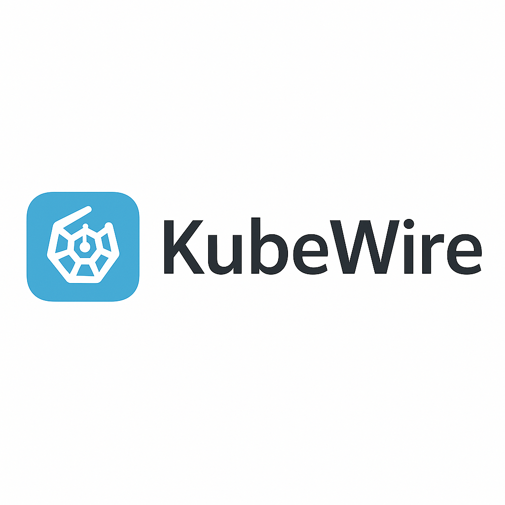

# ⚡ KubeWire

<p align="left">
  
</p>

> Visual and interactive port-forwarding for Kubernetes services.  
> Automatically discovers clusters, namespaces, and services via `kubectl`.  
> Fast tunnels. Clean interface. Zero manual configuration.

---

## 🚀 Features

- 🖥️ Graphical (GUI) and terminal (TUI) interface for managing port-forwarding
- 🔍 Automatic discovery of contexts, namespaces, and services with `kubectl`
- 🚪 Start/stop tunnels with a click or from the terminal
- 🎯 Multi-cluster with status indicators and monitoring
- 📜 Real-time log visualization (GUI)
- 🔔 Sound notifications for drops/disconnections
- 💾 Automatic `config.yml` generation (or optional manual configuration)
- 💥 Robust error handling: endpoints, ports, authentication

---

## 🏗️ Architecture

KubeWire is composed of modules for discovery, modeling, monitoring, and UI. See [architecture.md](architecture.md) for technical details and diagrams.

---

## 📦 Installation

```bash
git clone https://github.com/zedven/kubewire.git
cd kubewire
python3 -m venv .venv
source .venv/bin/activate  # or `.venv\Scripts\activate` on Windows
pip install -r requirements.txt
```

---

## 🖥️ Usage

### GUI (Graphical Interface)

```bash
python -m core.main  # By default, launches the GUI
```

- Select the Kubernetes context
- Start/stop services with a click
- View real-time logs
- Receive sound alerts on drops

### TUI (Terminal UI)

Edit `core/main.py` and change `MODE = "gui"` to `MODE = "tui"`, then:

```bash
python -m core.main
```

- Navigate contexts and services from the terminal
- Use commands to start/stop tunnels and view logs

---

## 📝 Notes

- Requires `kubectl` installed and access to clusters
- Supports macOS, Linux, and Windows
- For richer logs, also install `stern` (optional)
- You can create or edit `config/config.yml` manually if desired

---

## 📚 More information

- [architecture.md](architecture.md): Technical details and diagrams
- Issues and support: open an issue on GitHub
